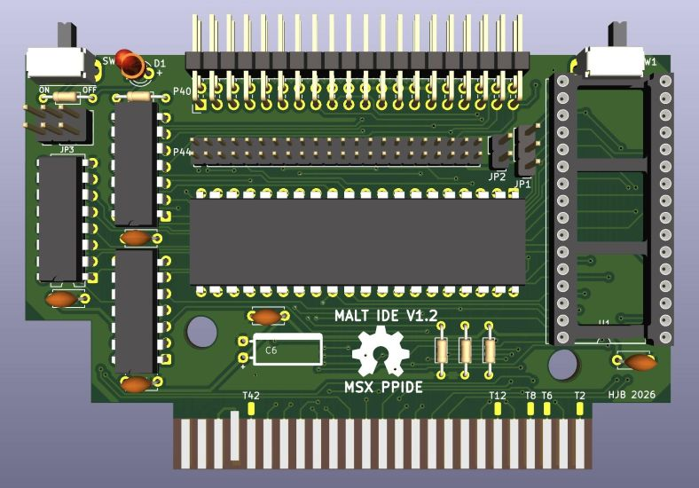

# MALT IDE

MSX 8255 PPI IDE board that is based on the Eurocard Bus DiskIO V3 PPIDE design for retrocomputers.

It uses the same 8255 PPI chip as the MSX BEER interface but the IDE control signals are implemented in a more robust way.

## Features

* Interface for IDE harddisks and CF cards (with IDE adapter)
* Flash the disk ROM in-system on MSX
* Selectable I/O address
* MSX-DOS 1 and 2 disk system driver (ATA master disk only)
* RomWBW CP/M PPIDE driver that supports ATA, ATAPI and master/slave drives

>[!CAUTION]
>If the SW1 switch is mounted then the JP1 jumper should not be used.  
> Only toggle the SW1 switch (right side) when the MSX computer is off.
>
>The SW2 switch (left side) can be toggled when the MSX computer is on.

## Howto build

A basic understanding of the MSX (disk) system, soldering skills and knowledge of retro computer electronics is required to build and use this cart.

1. Send the Gerbers ZIP file to your favorite PCB manufacturer for production
2. Choose the build options
3. Source the [required components](malt_bom.csv)
4. Populate the PCB with the components
5. Set the jumpers / switches
6. Test the cart hardware and disk media
7. Flash the disk ROM
8. Prepare the disk media for use with the disk ROM

## Build options

**Choose the type of IDE connector**
1. 44-pin: remove pin 20 before soldering it to the PCB.
2. 40-pin: populate jumper JP2 to connect +5V to pin 20 for use with a CF card adapter.

**Choose flash ROM or EEPROM**
1. SST flash ROM (default)  
The cart can be used with 128K, 256K or 512K SST (or other JEDEC compatible) flash ROM.  
Use a jumper (JP1) or SPDT switch (SW1) to switch between two ROM banks.  
Don't populate the PCB with both JP1 and SW1 or else you can create a short circuit!  
The switch or jumper should only be toggled when the MSX computer is off!

2. W27C512 EEPROM  
Make sure to place the 28-pin chip correctly in the 32-pin socket. See pictures.  
Flash the disk ROM with an external programmer like the T48.  
A standard 32KB disk ROM image should start at EEPROM address 0x4000!  
The ROM bank switch/jumper will have no function.

**Select an I/O address range with jumper JP3**

1: 0x1C-0x1F  
2: 0x34-0x37 (default)  
3: 0x3C-0x3F

The MSX-DOS software driver will try to autodetect the selected I/O address.

**Select disk media type to use with the cart**

1. Compact Flash (default)  
There are CF to IDE adapters for 40 pin or 44 pin IDE connectors. The front of the adapter should point to the backside of the MSX cart! See pictures.  
Some of the 40 pin CF adapters have pin 20 blocked. You can still use them if you drill a hole and connect a dupont wire between the CF card power conector (LP4) and jumper JP2 +5V pin. See pictures.  

2. Classic 2,5" notebook harddisk  
This type of disk uses a 44-pin connector. It is not recommended to power the harddisk via the MSX! Instead use an external power supply and a custom built adapter cable.

3. Classic 3,5" harddisk  
This type of disk uses a 40-pin connector. A 40-pin flat cable may have pin 20 blocked. Use an external molex power adapter (or old ATX power supply). 

4. Other ATA/IDE disks   
E.g. using SD to IDE adapter or SATA to IDE. These options are not tested yet.

## Hardware test

1. Minimal test with a multi-meter the resistance between +5V and GND that there is no short circuit.
2. Set SW2 to OFF position, insert the cart in a MSX slot, power on the MSX and use the TASTE program (loaded from tape or 2nd disk system) to test if the disk interface is detected and the disk works correctly.
3. Prepare the disk media with a test disk image and check if the MSX will boot into MSX-DOS.
   
The LED on the cart should light up whenever there is disk activity.
      
## Flash disk ROM

You can use the [flask program](https://github.com/b3rendsh/msxdos2s/tree/main/flask) to flash a disk image to the selected ROM bank.
1. Power off the MSX computer
2. Select the ROM bank with jumper JP1 or switch SW1
3. Set the ROM enable switch SW2 to OFF position
4. Power on the MSX
5. Toggle switch SW2 to enable flashing to the ROM
6. Flash the ROM from a 2nd disk system (e.g. floppy) 
7. Reboot the MSX

If you don't have a 2nd disk system then you can load [CXDOS1D.BIN](https://github.com/b3rendsh/cxdos) from tape to flash the ROM. In this scenario the disk media should have a valid MSX FAT partition with flask.com and disk image file. The MSX tape input can be used with an android phone and msx2cas app to load the bin file. Alternatively you can also a convert a bin file to a wav file with openMSX and play the wav on a suitable device.

## Notes

Schematics and Kicad project files are provided so you can make changes if you want to.

The 8255 PPI chip has been used for different types of interfaces. E.g. with a few changes you can create a multi-i/o board or a bidirection printer port. The unused pins on the cart's edge connector have small solder pads to facilitate this type of experiments.

The cart should fit in a Konami type case with some cutouts for the switches and ic's if sockets are used.

## Pictures

[MALT IDE 44-pin](pictures/malt_p44_cf.jpg)

[MALT IDE 40-pin](pictures/malt_p40.jpg)

[more pictures](pictures/)

